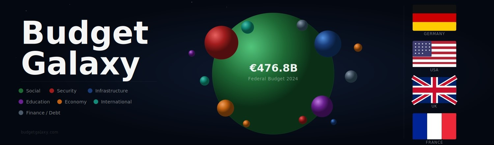
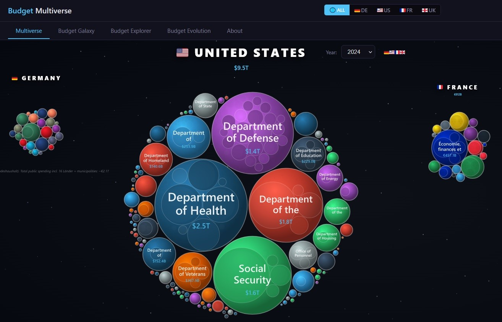

<h1 align="center">Budget Galaxy</h1>

<p align="center">
  <i>Explore how nations spend. Every ministry, every department, every dollar, euro and pound — visualized.</i>
</p>

<p align="center">
  <a href="https://budgetgalaxy.com"></a>
</p>

<p align="center">
  <a href="https://budgetgalaxy.com/methodology.html">Methodology</a> ·
  <a href="https://github.com/JuanBlanco9/Budget-Galaxy">GitHub</a> ·
  MIT License · Open Source
</p>

<p align="center">
  
</p>

<p align="center">
  
  
  
  
  
  
  
</p>

---

## What is Budget Galaxy?

Budget Galaxy is an interactive visualization of federal and public sector budgets, built from official government data sources. Navigate from a country's full budget down to individual line items, trusts, councils and suppliers in three clicks. Compare four countries side by side. See how spending evolved through COVID-19, the Zeitenwende, and the energy crisis.

Every sphere represents real public money traceable to a specific published dataset. Every transformation applied to that data is documented in the [methodology page](https://budgetgalaxy.com/methodology.html).

---

## Coverage

| Country | Source | Years | Detail |
|---------|--------|-------|--------|
| :de: Germany | bundeshaushalt.de (BMF) | 2015–2024 | L1–L4 (4,388 line items) |
| :gb: UK | OSCAR HM Treasury | 2015–2024 | L1–L4 (40 departments) |
| :gb: UK | Spend Over £25k | 2024 | L5–L6 (645k transactions) |
| :gb: UK | NHS Provider Accounts (TAC) | 2022/23, 2023/24 | L5 (206–212 trusts) |
| :gb: UK | Local Government (MHCLG) | 2017–2025 | L5 (~400 councils/year) |
| :us: USA | USAspending.gov | 2017–2025 | L1–L4 (111 agencies) |
| :fr: France | data.gouv.fr (PLF + DREES) | 2015–2025 | L1–L4 (20+ ministries) |

**UK public sector coverage (2024): approximately 85% of Total Managed Expenditure (£1.38T visualised).**

---

## Features

### Multiverse
All four countries in one comparable canvas. Sphere sizes are proportional across countries so you can see at a glance how Germany's defense budget compares to France's education spending.

<p align="center">
  
</p>

### Budget Galaxy
Zoomable circle-packing visualization. Each ministry is a sphere containing its departments and budget items. Click any sphere to zoom in. Scroll to zoom. Drag to pan. Side panel with enriched descriptions, beneficiary data, and spending breakdowns.

<p align="center">
  
</p>

### Budget Explorer
Navigate the budget hierarchy with breadcrumb navigation. Each level shows breakdowns with percentages and enriched context — beneficiary counts, legal basis, international comparisons. Segmented supplier drill-down for 15 UK departments (Navy Command, NHS ICBs, Arts Council, PIP, HS2...).

### Budget Evolution
10+ years of historical data in a customizable line chart. Toggle between absolute amounts and % of total. Annotated with key events: COVID-19, Zeitenwende, CARES Act, Brexit.

### NHS Trust Panel
Drill from the NHS Provider Sector top-level node down to any of 206+ trusts. Each trust shows its Integrated Care Board commissioner, sector (Acute / Mental Health / Specialist / Community / Ambulance), region, and a 4-category operating expenditure breakdown (Staff / Supplies / Premises / Other) sourced from NHS England's Trust Accounts Consolidation.

### Fiscal Netting
Budget Galaxy removes double-counting at multiple levels: NHS commissioning vs provider spending, local government grants vs service expenditure, and OSCAR data quality fixes. All corrections are documented and traceable — the residuals are visible in the tree with provenance metadata.

---

## Data Pipeline

Scripts in `/scripts/` (Node.js and Python):

| Script | Purpose |
|--------|---------|
| `inject_nhs_trusts.js` | Parse NHS TAC xlsx → `nhs_provider_sector` node (year-configurable) |
| `build_icb_mapping.js` | NHS ODS Spine API → ICB-Trust mapping (211 trusts, 36 ICBs) |
| `build_nhs_trust_breakdown.js` | TAC EXP subcodes → 4-category breakdown per trust |
| `inject_nhs_trust_detail.js` | Inject breakdown + ICB metadata into tree |
| `net_nhs_overlap.js` | Net DHSC ↔ NHS Provider Sector double-counting |
| `fix_oscar_2023_nhs.js` | Remove £114B OSCAR 2023 "Non-patient-facing" data artifact |
| `inject_local_gov.js` | MHCLG Revenue Outturn → `local_government_england` node |
| `replace_oscar_lg.js` | Replace OSCAR II LG placeholder with Revenue Outturn (2020–2023) |
| `deduce_intergovernmental_{de,fr,uk,us}.js` | Document inter-governmental transfer overlaps |

See the [methodology page](https://budgetgalaxy.com/methodology.html) for the full provenance of every dataset.

---

## Key Data Files

- `data/uk/uk_budget_tree_{year}.json` — UK trees 2015–2024 (OSCAR + Local Gov + NHS netting)
- `data/bundeshaushalt_tree_{year}.json` — German trees 2015–2024
- `data/us/us_budget_tree_{year}.json` — US trees 2017–2025
- `data/fr/fr_budget_tree_{year}.json` — France trees 2015–2025
- `data/recipients/uk/l5_{dept}_2024.json` — UK supplier L5 (15 departments)
- `data/recipients/uk/supplier_enrichment.json` — 502 suppliers with sector/description
- `data/uk/nhs_trust_breakdown_{year}.json` — NHS 4-category breakdown per trust
- `data/uk/nhs_icb_trust_mapping.json` — 211 trusts × ICB commissioning map
- `data/uk/intergovernmental_uk_{year}.json` — Fiscal consolidation documentation

---

## Architecture

```
Frontend (~500KB HTML)        Backend (FastAPI)
┌──────────────────────┐     ┌──────────────────────┐
│  D3.js Circle Pack   │◄───►│  /budget/tree         │
│  Chart.js Evolution  │◄───►│  /budget/country/{id} │
│  Budget Explorer     │◄───►│  /budget/history      │
│  Multiverse SVG      │     └──────────────────────┘
└──────────────────────┘            │
                              Static JSON trees
                              per country (no DB)
```

**Stack:** D3.js v7 · Chart.js 4 · Vanilla JS · FastAPI · Python 3.12 · Uvicorn · nginx · Let's Encrypt

---

## Quick Start

```bash
git clone https://github.com/JuanBlanco9/Budget-Galaxy.git
cd Budget-Galaxy
pip install -r requirements.txt
uvicorn api.main:app --host 0.0.0.0 --port 8088
open http://localhost:8088
```

---

## API

| Method | Endpoint | Description |
|--------|----------|-------------|
| GET | `/budget/tree?year=YYYY` | German budget tree |
| GET | `/budget/country/{id}?year=YYYY` | US / FR / UK budget tree |
| GET | `/budget/country/{id}/history` | Historical data for country |
| GET | `/budget/history` | German 11-year history |
| GET | `/data/recipients/uk/l5_{dept}_{year}.json` | UK supplier L5 per department |
| GET | `/methodology.html` | Full methodology page |
| GET | `/sitemap.xml` | SEO sitemap |
| GET | `/health` | Health check |

---

## Methodology

Full data source documentation, coverage notes, fiscal consolidation methodology, and the OSCAR 2023 data quality correction are documented on the methodology page:

**[budgetgalaxy.com/methodology.html](https://budgetgalaxy.com/methodology.html)**

---

## Limitations

Summary (see [methodology page](https://budgetgalaxy.com/methodology.html) for full details):

- German data is **planned budget, not actual spending** (Soll, not Ist)
- UK OSCAR data is **planned budget, not final outturn**
- UK Spend Over £25k **misses below-threshold payments**
- NHS trust accounts **exclude 3–5 trusts per year** whose accounts had not been adopted at publication date
- OSCAR schema changed between OSCAR I (pre-2020) and OSCAR II (2020+), causing **year-on-year discontinuities** in the 2018–2020 range
- Off-budget items (German Sondervermögen, UK UKEF, Network Rail) are **not included**
- Devolved UK governments (Scotland, Wales, Northern Ireland) are **not in Local Government** dataset

---

## Roadmap

- [ ] France Collectivités territoriales (Eurostat S1313 already parsed, needs UI integration)
- [ ] Germany supplier data (Zuwendungsdatenbank)
- [ ] UK NHS TAC historical years (2020/21, 2021/22)
- [ ] Budget Comparator tab (side-by-side year/country)
- [ ] IMF GFS data — ~130 countries at Level 1
- [ ] Canada, Spain, Italy, Brazil, Mexico, Japan

---

## Contributing

Want to add a country or improve the data pipeline? Open an issue.

When adding data: every figure must come from a downloaded, parseable official source with a documented URL. Approximate figures are never acceptable — see the project memory on honest data practice.

---

## Support

Budget Galaxy is free and open source. If you find it useful:

[](https://github.com/sponsors/JuanBlanco9)

Your support helps add more countries, keep the data updated, and improve the platform.

---

## License

MIT · Open Source · Open Data

Data is used under open government licences:
- **UK:** Open Government Licence v3
- **Germany:** Open Government Data `dl-de/by-2-0`
- **US:** Public domain (USAspending.gov)
- **France:** Licence Ouverte / Open Licence

This project has no affiliation with any government body.

---

*Every euro collected from citizens should be understandable to those citizens.*

**Juan Blanco** · [@JuanBlanco9](https://github.com/JuanBlanco9)
