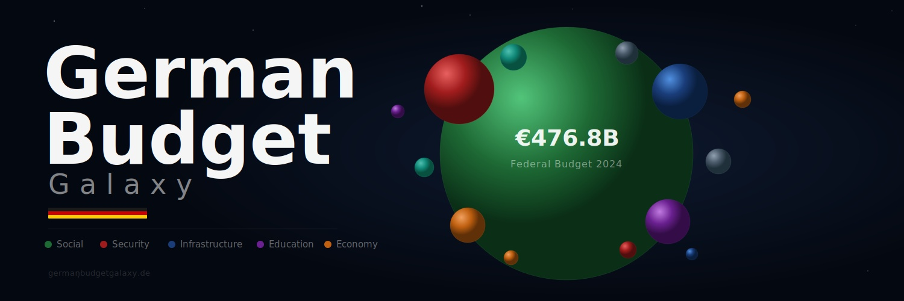

<p align="center">
  <h1 align="center">German Budget Galaxy</h1>
</p>

<p align="center">
  
</p>

<p align="center">
  <i>Interactive visualization of the entire German federal budget (Bundeshaushalt 2024)</i>
</p>

<p align="center">
  
  
  
  
  
</p>

---

## Overview

**German Budget Galaxy** transforms the German federal budget into an explorable universe. Navigate **11 years of budget data (2015–2025)** — from EUR 299B to EUR 502B — across 25 ministries, 216 departments, and 4,388 individual budget items. Switch between any year to see how the budget evolved through the Eurozone crisis, COVID-19, the Zeitenwende, and the energy crisis.

Every sphere represents a real budget allocation. The size is proportional to the amount. Click to explore. Zoom to see details. Every euro is traceable to an official line item in the Bundeshaushalt.

## Live Demo

**[germanbudgetgalaxy.com](http://germanbudgetgalaxy.com)** *(coming soon)*

## Screenshots

### Budget Galaxy
<p align="center">
  
</p>

### Budget Explorer
<p align="center">
  
</p>

### Ministry Detail
<p align="center">
  
</p>

## Features

### Budget Galaxy
Zoomable circle-packing visualization where each ministry is a sphere containing its departments and budget items. Sphere gradients, starfield background, and hover-dim effects for intuitive exploration.

### Budget Explorer
Navigate the budget hierarchy with a breadcrumb trail. Each level shows breakdowns with percentages, spending type analysis (personnel vs. transfers vs. investments), and enriched context — beneficiary counts, international comparisons, legal basis.

### Budget Evolution
11 years of budget data (2015–2025) in a customizable chart. Compare categories or individual ministries. Toggle between absolute EUR and % of total. Annotated with key events: COVID-19, Zeitenwende, energy crisis.

### Enriched Data
75 budget nodes enriched with real-world context from official sources:
- **Beneficiary data**: 21.8M pensioners, 5.5M Burgergeld recipients, 74.3M health insurance members
- **International comparisons**: OECD, NATO, Eurostat benchmarks
- **Legal basis**: SGB references, constitutional articles
- **Historical evolution**: trend analysis with key reform dates

## Architecture

```
Frontend (Single-page HTML)         Backend (FastAPI)
┌─────────────────────┐            ┌──────────────────┐
│  D3.js Circle Pack  │◄──────────►│  /budget/tree     │
│  Chart.js Evolution │◄──────────►│  /budget/history  │
│  Budget Explorer    │◄──────────►│  /budget/history/ │
│  Enriched Panels    │            │    kategorien     │
└─────────────────────┘            └──────┬───────────┘
                                          │
                                   ┌──────▼───────────┐
                                   │   PostgreSQL      │
                                   │   528,926 records │
                                   │   16 sources      │
                                   └──────────────────┘
```

## Data Sources

| Source | Data | Description |
|--------|------|-------------|
| [bundeshaushalt.de](https://www.bundeshaushalt.de) | 11 annual CSVs | Official federal budget 2015–2025 (EPL → KAP → Titel) |
| [deutsche-rentenversicherung.de](https://www.deutsche-rentenversicherung.de) | Pension stats | 21.8M pensioners, avg. pension, contribution rates |
| [statistik.arbeitsagentur.de](https://statistik.arbeitsagentur.de) | Employment stats | Bürgergeld recipients, jobcenters, integration rates |
| [data.oecd.org](https://data.oecd.org) | Intl. comparisons | Social expenditure, health, education, defence benchmarks |
| [nato.int](https://www.nato.int) | Defence data | NATO spending targets, member country comparisons |
| [destatis.de](https://www.destatis.de) | Official statistics | Demographics, BAföG, housing, recycling rates |
| [gkv-spitzenverband.de](https://www.gkv-spitzenverband.de) | Health insurance | 74.3M insured, contribution rates, fund expenditure |
| Enrichment Data | 75 nodes | Curated context from all sources above |

## Tech Stack

| Component | Technology |
|-----------|------------|
| Frontend | Single HTML file, D3.js v7, Chart.js 4, Vanilla JS |
| Backend | FastAPI, SQLAlchemy, Python 3.12 |
| Database | PostgreSQL |
| Visualization | D3.js circle packing, Canvas 2D, Chart.js |
| Server | Ubuntu 24.04, Uvicorn, Vultr VPS |
| Translation | Bilingual DE/EN with 300+ translations |

## Quick Start

### Docker
```bash
docker-compose up -d
```

### Local Development
```bash
# Clone
git clone https://github.com/JuanBlanco9/German-Budget-Galaxy.git
cd German-Budget-Galaxy

# Backend
pip install -r requirements.txt
uvicorn api.main:app --host 0.0.0.0 --port 8088

# Open browser
open http://localhost:8088/app
```

## API Endpoints

| Method | Path | Description |
|--------|------|-------------|
| GET | `/app` | Main application (frontend) |
| GET | `/health` | Health check |
| GET | `/budget/tree` | Complete budget hierarchy (EPL → KAP → Titel) |
| GET | `/budget/history` | Historical data by Einzelplan (2015-2024) |
| GET | `/budget/history/kapitel` | Historical data by Kapitel |
| GET | `/budget/history/kategorien` | Historical data by category |

## Data Integrity

All budget data has been audited against official sources:

- **25/25 Einzelplane** internally consistent (children sum = parent)
- **Percentages sum to 100.000000%**
- **4,388 Titel** verified against bundeshaushalt.de
- **75 enriched nodes** fact-checked against official statistics (DRV, BA, OECD, NATO)
- **34 negative values** — all are Globalminderausgaben (mandatory savings), which is correct

## Limitations

- Shows **planned budget (Soll)**, not actual spending (Ist)
- **Off-budget items** (Sondervermogen Bundeswehr EUR 100B, Klima- und Transformationsfonds) not included
- Enrichment data is approximate, from various reporting periods (2023-2024)
- 4 minor EPL totals differ from official values by <3.6% due to CSV parsing edge cases

## Support

Budget Galaxy is free and open source. If you find it useful, consider supporting its development:

[](https://github.com/sponsors/JuanBlanco9)

Your support helps add more countries, keep the data updated, and improve the platform.

## License

MIT

## Author

**Juan Blanco** — [@JuanBlanco9](https://github.com/JuanBlanco9)

---

<p align="center">
  <i>Every euro collected from citizens should be understandable to those citizens.</i>
</p>
